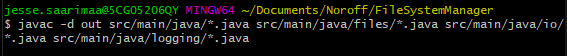
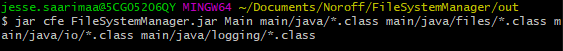
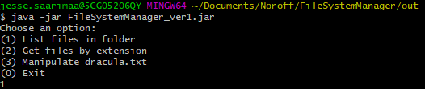

# File System Manager

This is a Java console application from which the user can gather information about files in a certain project folder. The application includes complete logging service with timestamps and function/method call durations (in ms). The application has been compiled without an IDE, using javac and jar.

### Main Functions

1. The user can print all the files in the folder

2. The user can search a file by its extension

3. The user can search for .txt -file name

4. The user can do following actions with provided Dracula.txt -file:
    - Get name of the file
    - Get size of the file (in bytes)
    - Get the count of how many lines are there
    - Search for specific word in the file

### Compiling

The application has been compiled using following commands:

> $ javac -d out src/main/java/*.java src/main/java/files/*.java src/main/java/io/*.java src/main/java/logging/*.java
> $ jar cfe FileSystemManager.jar Main main/java/*.class main/java/files/*.class main/java/io/*.class main/java/logging/*.class

### Here are the screenshots of the project being compiled:

The command which compiled javas to classes

The commands which created .jar file

The command showing that .jar is working

